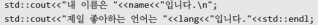
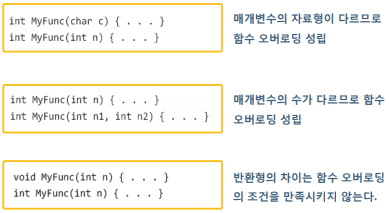
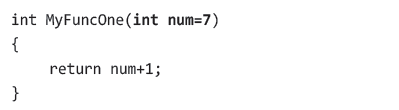
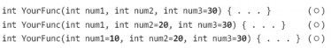
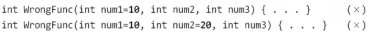
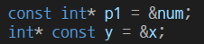

# iot-Cpp-Basic

## Cpp 기본

### 1일차
1. 기본 입출력 : [확인](./Base/Base01/Base01.cpp)
    
    
    - 자료형이 다른 변수들을 연속해서 입력 받을 수 있고 출력할 수 있다.
    - std::endl은 \n + 버퍼 초기화

2. 함수 오버로딩 : 뒤에 자세히
    - 동일한 이름의 함수(메서드)지만 매개변수의 선언이 다르다면 함수 정의 가능.
    
    - 디폴드 값, 인자를 전달하지 않으면 자동으로 값이 들어감. [확인](./Base/Base02/Base02.cpp)
    
    MyFuncOne(); == MyFuncOne(7);

    - 
    - 
        - 인자를 주면 왼쪽부터 들어가기에 디폴트값은 오른쪽부터 지정해줘야함.

3. inline 함수 선언 : [확인](./Base/Base03/Base03.cpp)
    - 일반 함수에 비해 성능 향상을 기대하지만 자료형에 대해 독립적이지 못함.
    - 짧고 반복 호출되는 함수에 적합.

4. 이름 공간 함수 선언 : [확인](./Base/Base04/Base04.cpp)
    - '::'이란 범위 지정 연산자
        - 어떤 이름(변수,함수,클래스 등..)이 속한 범위를 명시적으로 지정할 때 사용
        - 전역 변수 접근 (::x) : [확인](./Base/Base05/Base05.cpp)
        - 클래스 범위 지정 (ClassName::member)
        - 네임스페이스 접근 (Namespace::name)
    - std를 붙이는 이유는 선언의 이름의 중복성을 피하기 위함인데 `using` namespace std 를 통해 std 생략 가능 >> 제한적으로 사용.

5. Const - 포인터 : [확인](./Base/Base06/Base06.cpp)
    - 
    - 1행은 값 변경 불가능, 2행은 주소 변경 불가능
    - 앞 뒤로 const를 붙여 값,주소 모두 변경 불가능하게 가능

6. 포인터 변수 대상 참조자 : [확인](./Base/Base07/Base07.cpp)
