# iot-Cpp-Basic

## Cpp 기본

### 1일차
1. 기본 입출력 : [확인](./Base/Base01/Base01.cpp)
    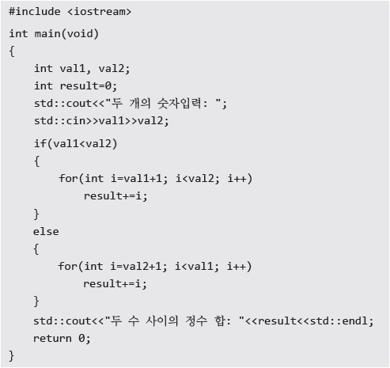
    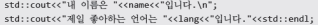
    - 자료형이 다른 변수들을 연속해서 입력 받을 수 있고 출력할 수 있다.
    - std::endl은 \n + 버퍼 초기화

2. 함수 오버로딩 : 뒤에 자세히
    - 동일한 이름의 함수(메서드)지만 매개변수의 선언이 다르다면 함수 정의 가능.
    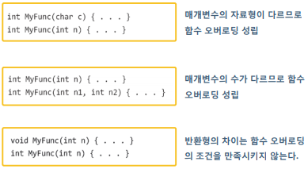
    - 디폴드 값, 인자를 전달하지 않으면 자동으로 값이 들어감. [확인](./Base/Base02/Base02.cpp)
    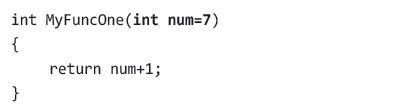
    MyFuncOne(); == MyFuncOne(7);

    - 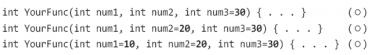
    - 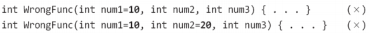
        - 인자를 주면 왼쪽부터 들어가기에 디폴트값은 오른쪽부터 지정해줘야함.

3. inline 함수 선언 : [확인](./Base/Base03/Base03.cpp)
    - 일반 함수에 비해 성능 향상을 기대하지만 자료형에 대해 독립적이지 못함.
    - 짧고 반복 호출되는 함수에 적합.

4. 이름 공간 함수 선언 : [확인](./Base/Base04/Base04.cpp)
    - '::'이란 범위 지정 연산자
        - 어떤 이름(변수,함수,클래스 등..)이 속한 범위를 명시적으로 지정할 때 사용
        - 전역 변수 접근 (::x) : [확인](./Base/Base05/Base05.cpp)
        - 클래스 범위 지정 (ClassName::member)
        - 네임스페이스 접근 (Namespace::name)
    - std를 붙이는 이유는 선언의 이름의 중복성을 피하기 위함인데 `using` namespace std 를 통해 std 생략 가능 >> 제한적으로 사용.

5. Const - 포인터 : [확인](./Base/Base06/Base06.cpp)
    - 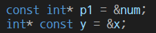
    - 1행은 값 변경 불가능, 2행은 주소 변경 불가능
    - 앞 뒤로 const를 붙여 값,주소 모두 변경 불가능하게 가능

6. 포인터 변수 대상 참조자 : [확인](./Base/Base07/Base07.cpp)

### 2일차
1. 배열,레퍼런스 : [확인](./Base/ref04/ref04.cpp)

2. 메모리 할당 방법
    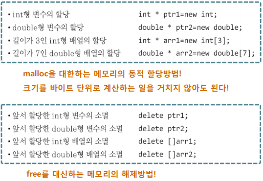

3. 클래스 비교 
    - C 구조체 : [확인](./Base/class01/class01.cpp)
    - C++ 구조체 : [확인](./Base/class02/class02.cpp)
    - C++ 클래스 : [확인](./Base/class04/class03.cpp)
    - C++ 클래스2 : [확인](./Base/class04/class04.cpp)
    - 응용 : [확인](./Base/MyClass/MyClass.cpp),[확인](./Base/MyClass02/MyClass02.cpp)

4. 이니셜라이저 초기화 : [확인1](./Base/initial02/initial02.cpp), [확인2](./Base/initial03/initial03.cpp)

### 3일차
1. 복사 생성자  : [확인](./Base/copycon/copycon.cpp)(얕은 복사)
    - 생성자란?
        - 클래스 이름과 같은 이름을 가진 함수
        - 리턴 타입이 없음(void)도 안붙임
        - 객체가 만들어질 때 자동으로 호출됨

    - 생성자에서 `char타입에 const가 붙는 이유`?
        - 문자열 리터럴은 수정하면 안되기 때문.

    - 복사 생서자를 쓰는 이유?
        - `메모리`
        - 안쓰면 포인터주소만 복사(얕은 복사)
            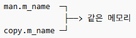
        - 쓰면 내용도 복사 (깊은 복사)
            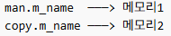
    - 소멸자란? 
        - 객체가 사라질 때 필요한 정리 작업을 자동으로 수행하기 위함.
            - 없으면 메모리 누수(memory leak) 우려

2. C++ 동적할당 : [확인](./Base/copycon02/new1.cpp)
    - new ~ delete[]
    - 깊은 복사 : [확인](./Base/copycon02/copycon02.cpp)

3. 이동 생성자 : [확인](./Base/moveconstructor/moveconstructor.cpp)
    - 복사 생성자는 객체를 모두 복사해서 사용하고 이동 생성자는 원본 객체를 복사하지 않는다.
    - move호출은 객체를 rvalue로 캐스팅하여 이동생성자에 전달된다.
    - 주소를 새객체로 복사하고 기본 객체는 null로 처리한다(소유권 이전)
    -  this ? 
        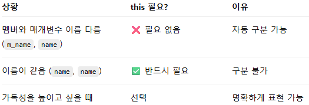

4. 변환 생성자 : [확인](./Base/conversionconstructor/conversionconstructor.cpp)

### 4일차(다른 강사 대체)

1. 변수 간단히 [확인](./chap01/Basic01/Basic01.cpp),[확인](./chap01/Basic02/Basic02.cpp)

2. 연산자 [확인](./chap01/04.condition/04.condition.cpp)
3. 루프 [확인](./chap01/05.Loop-02/05.Loop-02.cpp),[확인](./chap01/05.Loop-03/05.Loop-03.cpp)
4. 함수 [함수](./chap01/06.function/06.function.cpp)

### 5일차

1. 함수
    - cin >> noskipws >> 변수
        - noskipws는 공백(스페이스,엔터,탭)을 그대로 입력받음.
    - isalpha()는 문자가 알파벳인지 확인하는 함수(cctype)
    - toupper()는 소문자를 대문자로 바꾸는 함수(cctype)
    - tolower()는 대문자를 소문자로 바꾸는 함수(cctype)
    
2. 클래스
    - static은 메서드 영역에 저장, 일반 변수는 heap영역에(사라짐)
    - static은 static만 가능 static이 상위개념
    
    
